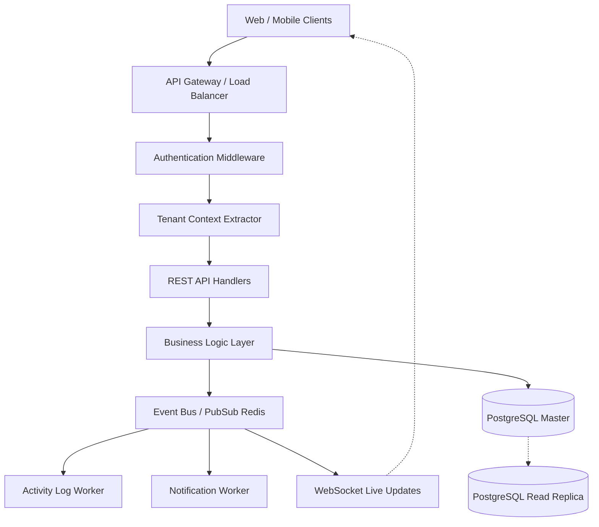

# EstateFlow CRM Backend Architecture

This document outlines the production-grade, multi-tenant SaaS backend architecture for **EstateFlow CRM**, designed to serve both Web and Mobile clients seamlessly. 

## 1. System Architecture Diagram



---

## 2. Multi-Tenant Strategy

**Tenant Isolation Model: Logical Separation (Pool Model)**
To ensure zero cross-tenant data leakage while keeping the infrastructure cost-effective and scalable, we use a **Logical Separation** approach.

1. **`tenant_id` on every core table**: Every entity (Users, Leads, Tasks, Activities) contains a strictly enforced `tenant_id` column.
2. **Context Injection Middleware**: Every authenticated request passes through a JWT validator that extracts `tenant_id`, `userId`, and `role`, attaching them to the request context (e.g., `req.user`).
3. **Data Access Layer Policy**: All database queries are funneled through Prisma Client Extensions. We inject a global `where: { tenantId: req.user.tenantId }` clause into every `find`, `update`, and `delete` operation.
4. **PostgreSQL RLS (Defense-in-Depth)**: PostgreSQL Row-Level Security (RLS) is enabled. A session variable sets the `current_tenant_id` before queries, ensuring the database engine physically rejects cross-tenant queries if the application layer fails.

---

## 3. Database Schema (Prisma ORM)

```prisma
generator client {
  provider = "prisma-client-js"
}

datasource db {
  provider = "postgresql"
  url      = env("DATABASE_URL")
}

enum Role {
  OWNER
  MANAGER
  EMPLOYEE
  CHANNEL_PARTNER
}

enum LeadStage {
  NEW
  CONTACTED
  SITE_VISIT
  NEGOTIATION
  CLOSED_WON
  CLOSED_LOST
}

enum TaskStatus {
  PENDING
  COMPLETED
}

enum ActivityType {
  CALL
  NOTE
  VISIT
  STATUS_UPDATE
  SYSTEM_EVENT
}

model Tenant {
  id        String    @id @default(uuid())
  name      String
  createdAt DateTime  @default(now())
  updatedAt DateTime  @updatedAt
  deletedAt DateTime?

  users           User[]
  leads           Lead[]
  pipelineStages  PipelineStage[]
  tasks           Task[]
  activities      Activity[]
  channelPartners ChannelPartner[]
}

model User {
  id           String    @id @default(uuid())
  tenantId     String
  tenant       Tenant    @relation(fields: [tenantId], references: [id])
  
  name         String
  email        String    @unique
  passwordHash String
  role         Role
  status       String    @default("ACTIVE") // ACTIVE, INACTIVE
  lastLogin    DateTime?
  
  createdAt    DateTime  @default(now())
  updatedAt    DateTime  @updatedAt
  deletedAt    DateTime?

  // Relations
  createdUsers User[] @relation("UserCreator")
  createdBy    String?
  creator      User?  @relation("UserCreator", fields: [createdBy], references: [id])

  assignedLeads     Lead[]     @relation("LeadAssignee")
  createdLeads      Lead[]     @relation("LeadCreator")
  assignedTasks     Task[]     @relation("TaskAssignee")
  createdActivities Activity[] @relation("ActivityCreator")

  @@index([tenantId])
  @@index([email])
}

model Lead {
  id               String    @id @default(uuid())
  tenantId         String
  tenant           Tenant    @relation(fields: [tenantId], references: [id])
  
  name             String
  phone            String?
  email            String?
  source           String    // website, cp, manual, ads
  stage            LeadStage @default(NEW)
  budget           Float?
  propertyInterest String?

  assignedToId     String?
  assignee         User?     @relation("LeadAssignee", fields: [assignedToId], references: [id])

  createdById      String
  creator          User      @relation("LeadCreator", fields: [createdById], references: [id])

  createdAt        DateTime  @default(now())
  updatedAt        DateTime  @updatedAt
  deletedAt        DateTime?

  tasks            Task[]
  activities       Activity[]

  @@index([tenantId])
  @@index([tenantId, stage, assignedToId])
}

model PipelineStage {
  id                String   @id @default(uuid())
  tenantId          String
  tenant            Tenant   @relation(fields: [tenantId], references: [id])
  
  name              String
  order             Int
  probabilityWeight Float    @default(0.0)
  
  createdAt         DateTime @default(now())
  updatedAt         DateTime @updatedAt

  @@index([tenantId])
}

model Task {
  id           String     @id @default(uuid())
  tenantId     String
  tenant       Tenant     @relation(fields: [tenantId], references: [id])
  
  title        String
  status       TaskStatus @default(PENDING)
  dueDate      DateTime

  leadId       String
  lead         Lead       @relation(fields: [leadId], references: [id])

  assignedToId String
  assignee     User       @relation("TaskAssignee", fields: [assignedToId], references: [id])

  createdAt    DateTime   @default(now())
  updatedAt    DateTime   @updatedAt
  deletedAt    DateTime?

  @@index([tenantId])
  @@index([tenantId, assignedToId, status])
}

model Activity {
  id          String       @id @default(uuid())
  tenantId    String
  tenant      Tenant       @relation(fields: [tenantId], references: [id])
  
  type        ActivityType
  description String

  leadId      String
  lead        Lead         @relation(fields: [leadId], references: [id])

  createdById String
  creator     User         @relation("ActivityCreator", fields: [createdById], references: [id])

  timestamp   DateTime     @default(now())

  @@index([tenantId])
  @@index([leadId])
  @@index([tenantId, timestamp])
}

model ChannelPartner {
  id             String   @id @default(uuid())
  tenantId       String
  tenant         Tenant   @relation(fields: [tenantId], references: [id])
  
  name           String
  phone          String?
  commissionRate Float    @default(0.0)
  
  createdAt      DateTime @default(now())
  updatedAt      DateTime @updatedAt
  deletedAt      DateTime?

  @@index([tenantId])
}
```

---

## 4. API Route Design

All endpoints are prefixed with `/api/v1` and return the following standard JSON response wrapper:
```json
{
  "success": true,
  "data": { ... },
  "message": "Success",
  "meta": { "pagination": { "page": 1, "total": 50 } }
}
```

### Authentication (`/auth`)
- `POST /auth/login` - Authenticate user, return JWT (`userId`, `tenantId`, `role`).
- `POST /auth/register` - Create new Tenant and Owner account.
- `POST /auth/refresh` - Rotate short-lived access token using http-only refresh cookie.
- `GET /auth/me` - Retrieve current user profile and permission sets.

### Leads (`/leads`)
- `GET /leads` - List leads. (Filtered strictly by `tenant_id`. If `EMPLOYEE`, enforced filter `assignedToId = req.user.id`).
- `POST /leads` - Create a new lead.
- `GET /leads/:id` - Get specific lead details & relations.
- `PATCH /leads/:id` - Update lead details.
- `DELETE /leads/:id` - Soft delete lead.
- `PATCH /leads/:id/stage` - Update pipeline stage (Triggers system events).

### Pipeline (`/pipeline`)
- `GET /pipeline/stages` - List custom tenant pipeline stages.
- `POST /pipeline/stages` - Create a new stage.
- `PATCH /pipeline/reorder` - Reorder existing stages.

### Tasks (`/tasks`)
- `GET /tasks` - List tasks for the user.
- `POST /tasks` - Create a task linked to a Lead.
- `PATCH /tasks/:id` - Update task (e.g., mark as COMPLETED).
- `DELETE /tasks/:id` - Soft delete task.

### Activities (`/activities`)
- `GET /activities/:leadId` - Retrieve activity timeline for a specific lead.
- `POST /activities` - Log a manual activity (Call, Note, Visit).

### Users (`/users`)
- `GET /users` - List all users in tenant.
- `POST /users` - Admin invites/creates a new Employee/Manager.
- `PATCH /users/:id` - Modify user role/details.
- `DELETE /users/:id` - Deactivate user.

---

## 5. RBAC Security Matrix

| Module / Action | OWNER | MANAGER | EMPLOYEE | CHANNEL PARTNER |
| :--- | :---: | :---: | :---: | :---: |
| **Leads** |
| View All Leads | ✅ | ✅ | ❌ | ❌ |
| View Assigned Leads | ✅ | ✅ | ✅ | ❌ |
| View Submitted Leads| ✅ | ✅ | ✅ | ✅ |
| Create Leads | ✅ | ✅ | ✅ | ✅ |
| Update All Leads | ✅ | ✅ | ❌ | ❌ |
| Update Assigned Leads| ✅ | ✅ | ✅ | ❌ |
| Change Lead Stage | ✅ | ✅ | ✅ | ❌ |
| Delete Leads | ✅ | ❌ | ❌ | ❌ |
| **Tasks & Activities**|
| View Timeline (All) | ✅ | ✅ | ❌ | ❌ |
| View Timeline (Assigned)| ✅| ✅ | ✅ | ❌ |
| Log Activities | ✅ | ✅ | ✅ | ❌ |
| Create Tasks | ✅ | ✅ | ✅ | ❌ |
| **System Admin** |
| Manage Pipeline Stages| ✅ | ❌ | ❌ | ❌ |
| Add/Edit Employees | ✅ | ✅ | ❌ | ❌ |
| View Global Reports | ✅ | ✅ | ❌ | ❌ |
| Billing & Tenant Settings| ✅ | ❌ | ❌ | ❌ |

---

## 6. Event Flow for Lead Lifecycle (Real-Time Ready)

The system uses an **Event-Driven Architecture** (using Node EventEmitter internally or Redis Pub/Sub for scale) to decouple core CRM logic from side-effects.

1. **Lead Creation (`lead.created`)**
   - *Trigger*: API `POST /leads`
   - *Action*: Database save -> Emit Event.
   - *Subscribers*: 
     - **Activity Worker**: Auto-generates Activity log: "Lead created via [Source]".
     - **Notification Worker**: Pushes a notification to the assignee if assigned immediately.

2. **Stage Change (`lead.stage_changed`)**
   - *Trigger*: API `PATCH /leads/:id/stage`
   - *Subscribers*:
     - **Activity Worker**: Auto-generates Activity: "Stage updated to Negotiation".
     - **WebSocket Server**: Broadcasts the update to connected Web/Mobile clients viewing the Pipeline board for immediate UI reflection.

3. **Lead Assignment (`lead.assigned`)**
   - *Trigger*: Lead `assignedToId` updated.
   - *Subscribers*:
     - **Notification Worker**: Dispatches push notification/email to the new assigned Employee.
     - **Activity Worker**: Logs assignment to the timeline.

4. **Task Completion (`task.completed`)**
   - *Trigger*: API `PATCH /tasks/:id` with `status: COMPLETED`.
   - *Subscribers*:
     - **Activity Worker**: Injects completion record into the Lead's timeline.

---

## 7. Scalability & Performance Considerations

1. **Database Indexing**:
   - High-throughput read operations are supported by composite indices. Notice `@@index([tenantId, stage, assignedToId])` on the `Lead` model—this ensures that filtering by tenant, pipeline column, and user role executes in sub-millisecond times.
2. **Connection Pooling**:
   - Serverless or stateless container architectures will quickly exhaust DB connections. A connection pooler like **PgBouncer** or **Prisma Accelerate** sits between the API and PostgreSQL.
3. **Caching Strategy**:
   - Static/semi-static data like Pipeline Stages, User Profiles, and RBAC rules are cached in **Redis** per tenant, minimizing roundtrips to the primary database.
4. **Read Replicas**:
   - Dashboard aggregations, reporting, and large list queries run against PostgreSQL Read Replicas, leaving the Master node available for heavy transactional writes.
5. **WebSocket Offloading**:
   - Live updates are handled by an isolated WebSocket microservice. It subscribes to Redis Pub/Sub events and fans out payloads to connected clients, preventing the REST API layer from locking up on persistent connections.
